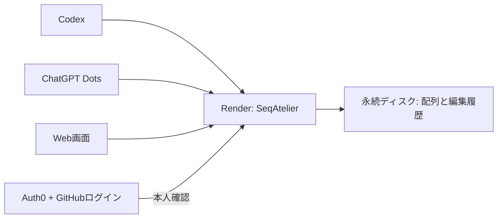

# 任意: HTTPSとOAuthでホスティング

以下は将来、専用サーバーで常時公開したい場合だけの参考設定です。
基本のローカル利用・Dropboxフォルダ利用には不要です。料金の発生するサービスは作成していません。
実Auth0ログイン・Render配置・Dots接続も未検証です。

## 任意構成の例

| 役割 | サービス・設定 |
| --- | --- |
| ソース配布 | GitHubの公開リポジトリ。MITライセンス |
| インストール配布 | まずGitHub Releasesのwheel。PyPIは後から追加可能 |
| 常時稼働 | Renderの1サービス、0.5 CPU / 512 MB（旧Starter） |
| 保存 | 1 GBの永続ディスクにSQLiteとGenBank履歴。単一インスタンス |
| ログイン | Auth0の無料枠＋GitHub。本人の固定IDを許可リストで指定 |
| ブラウザ | 同じサーバーのWeb画面。公式Auth0 SDKによるログイン |
| Codex・Dots | 同じサーバーの `/mcp`。Streamable HTTP＋OAuth |

これは一人用の初期構成です。許可リストへ他人を追加すると、その人も同じworkspace全体を使えます。
利用者別のデータ分離はありません。コードの公開と研究データの公開は別で、データは配布物に含めません。
手元のPCの稼働に依存せず、複数の端末から同じ履歴を使えます。

## 費用

2026-10-04確認時点で、Renderはサーバー月7米ドル、1 GBのディスク月0.25米ドルです。
Auth0は小規模なGitHubログインを無料枠で始める想定です。**基本構成は合計月7.25米ドルから**です。
税、為替、無料枠を超える通信・ビルド、将来のプラン変更は別です。これは請求上限の保証ではありません。
独自ドメインは購入せず、RenderとAuth0が発行するURLを使います。
Render無料サービスには永続ディスクを付けられないため、研究データを保存するこの構成には使いません。

- [Render公式料金](https://render.com/pricing)
- [Auth0公式料金](https://auth0.com/pricing)
- [Render永続ディスク](https://render.com/docs/disks)

## 初回だけ行う設定

以下は実施前の手順です。アカウント所有者がRender/Auth0へ登録・ログインし、Renderの請求先を設定します。
秘密鍵、GitHubのClient Secret、管理用トークンはチャット・ソースへ貼らず、各サービスの設定画面へ入力します。
SeqAtelier本体が必要とするのは公開Client IDと許可する本人IDで、GitHubのClient Secretをアプリへ渡す必要はありません。

1. GitHubの `mmtcc0731/seqatelier` へ配布用ソースだけを配置し、CIを通す。
2. Auth0に専用テナントと「Single Page Application」を作る。既定のAuth0ドメインとClient IDを控える。
3. 費用承認後、RenderでGitHubリポジトリからBlueprintを作成し、同梱 `deploy/render.yaml` を読み込む。
   この構成は有料サービス1個と永続ディスク1個を作る。自動再デプロイは無効。
4. 次の環境変数をRenderに設定する。初回ログインの準備中も、許可条件を満たさないアクセスは拒否される。

| 変数 | 入力値 |
| --- | --- |
| `SEQATELIER_AUTH_ISSUER` | `https://実際のAuth0ドメイン/` |
| `SEQATELIER_AUTH_CLIENT_ID` | Auth0のSingle Page Applicationの公開Client ID |
| `SEQATELIER_AUTH_SUBJECTS` | Auth0上で確認した本人のUser ID。GitHubログインなら通常 `github\|数値ID` |
| `SEQATELIER_WORKSPACE` | `/data`（Blueprintに設定済み） |

Auth0で確認した本人のUser IDを指定します。ユーザー名や表示名による判定はしません。
設定が欠ける場合、`host` は起動しません。

Renderは `RENDER_EXTERNAL_URL` を設定するため、通常 `SEQATELIER_PUBLIC_URL` は不要です。
独自ドメインを後から使う場合は、末尾スラッシュなしのHTTPS originを `SEQATELIER_PUBLIC_URL` に明示します。

5. Renderが発行した実際のURLを使い、Auth0にAPIを作る。Identifierは `https://実際のサービス.onrender.com` と完全一致させる。
   RS256署名、permission `workspace:access` を設定し、Web用SPAへこのAPIのユーザー委任アクセスを許可する。
6. Auth0のWeb用SPAに、Allowed Callback URLs、Allowed Logout URLs、Allowed Web Originsとして同じoriginを設定する。
   Authorization Code＋PKCE、Refresh Token Rotationを使う。APIでOffline Accessを許可する。
7. GitHub OAuth Appを登録し、callbackを `https://実際のAuth0ドメイン/login/callback` にする。
   そのGitHub Client ID/SecretをAuth0のGitHub social connectionへ設定する。
   このアプリではGitHubログインだけを有効にする。プライベートリポジトリへの権限は不要。
8. MCPクライアント用にAuth0でResource Parameter Compatibility ProfileとDynamic Client Registrationを有効にする。
   APIの「Default Permissions for third-party applications」に `workspace:access` を指定する。
   GitHub connectionはdomain-levelへ昇格し、DCRクライアントがログインに使えるようにする。
   DCRでアプリが登録されても本人許可リストの確認は必ず残る。

Auth0の設定画面は更新されるため、実テナントでdiscovery documentの `S256`、APIのaudience、scopeを確認します。
ChatGPTの管理画面が示すcallback URLをそのまま使います。古い記事の固定callbackを推測して設定しません。

- [GitHubログインの設定](https://auth0.com/docs/authenticate/identity-providers/social-identity-providers/github)
- [Auth0 DCRとAPI権限](https://auth0.com/docs/get-started/applications/dynamic-client-registration)
- [resourceパラメーター対応](https://support.auth0.com/center/s/article/mcp-audience-error-with-auth0)
- [OpenAIのOAuth仕様・callback](https://developers.openai.com/plugins/build/auth)

## 配置後の確認

1. `/health` が200で、未ログインの `/api/plasmids` と `/mcp` が401になること。
2. Webで本人のGitHubログインが成功し、他アカウントではデータへアクセスできないこと。
3. 人工配列を取り込み、保存・履歴・再起動後の復元を確認する。
4. CodexのMCP接続へ実際の `https://サービス/mcp` を登録し、OAuthログインする。
5. ChatGPTのプラグイン開発環境で同じMCPを接続し、Dotsから検索→設計プレビュー→保存を確認する。
6. この一連の確認後に、必要な研究データを取り込む。

公開済みプラグインの一般向け配布には、GitHubのソース公開とは別にOpenAI側で登録・審査が必要です。
最初は本人の開発用接続を完成させます。Dotsからの利用はアカウントのプラグイン権限・実行環境にも依存します。
この候補版でDotsへの接続が完了したとは扱いません。

- [Dotsのアプリ接続](https://learn.chatgpt.com/docs/dots/computers-and-apps)
- [MCP配置・接続確認](https://developers.openai.com/plugins/build/mcp-server)

## ローカル利用・データ移動

ローカルstdioは `seqatelier --workspace DATA mcp`、Webは `seqatelier --workspace DATA serve`。
一時的なBearer接続では `SEQATELIER_TOKEN` に32文字以上のランダム値を設定します。
外向きのMCPホスト名は `SEQATELIER_ALLOWED_HOSTS` に設定します。
この共有トークン経路はCodexなどの対応クライアント用です。ChatGPTへのクラウド接続には `host` のOAuth経路を使います。

`compose.yaml` は共有トークン付きのローカル検証用です。Renderでは別々のサービス間でディスクを共有できないため、
WebとMCPを一つにした `host` を実行します。コンテナはUID 10001です。独自のbind mountは書き込み権限を合わせます。

バックアップは `seqatelier --workspace DATA backup backup.zip` で作成します。
SQLiteの整合したスナップショットと全GenBank版を含みます。稼働中のSQLiteファイルだけをコピーしません。
ZIPは非公開の別ストレージへ保存し、復元時は新規の空ディレクトリへ展開します。
Renderのディスクsnapshotだけに依存せず、アプリのbackupでデータベースを含む保存を行います。
旧index.csv・発注JSONの自動移行は未実装です。元のデータを保管したままGenBankを取り込みます。

## 検証の範囲

現在の検証結果は [validation.md](validation.md) を参照してください。
